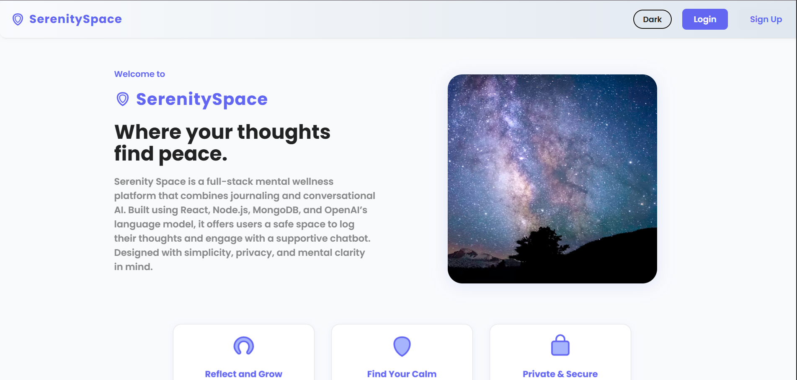
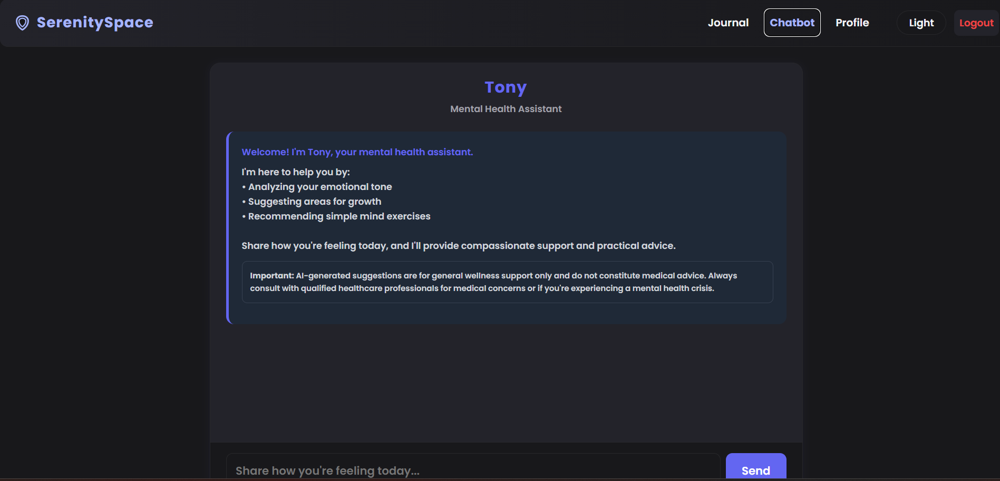
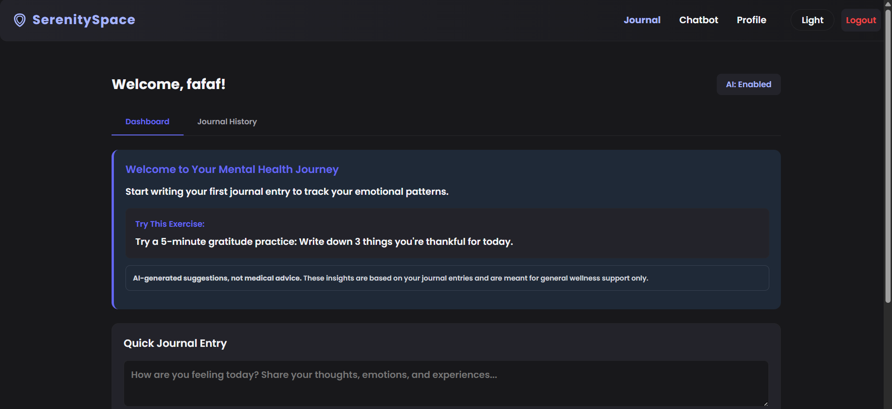

# SerenitySpace - Mental Wellness Platform

A full-stack mental wellness application that combines journaling and AI-powered conversational support.

# Live Demo

- **Frontend:** [https://serenityspacex.netlify.app/](https://serenityspacex.netlify.app/)
- **Backend:** [https://serenity-space-delta.vercel.app/](https://serenity-space-delta.vercel.app/) 

## Features

- 📝 **Journaling**: Private, AI-analyzed journal entries with sentiment tracking
- 🤖 **AI Chatbot**: Compassionate mental health assistant (Tony)
- 📊 **Mood Tracking**: Visual charts and insights from your journal entries
- 🌙 **Dark Mode**: Complete dark/light theme support
- 📱 **Mobile Responsive**: Optimized for all device sizes
- 🔐 **User Authentication**: Secure login/register system
- 🛡️ **Privacy**: User consent for AI analysis

## Tech Stack

### Frontend
- React 18
- Vite
- Chart.js
- CSS3 with responsive design

### Backend
- Node.js
- Express.js
- MongoDB (Mongoose)
- OpenAI API
- JWT Authentication

## Quick Start

### Prerequisites
- Node.js (v16 or higher)
- MongoDB
- OpenAI API key

## Screenshots

### Home page

### Chatbot page

### Journal page

